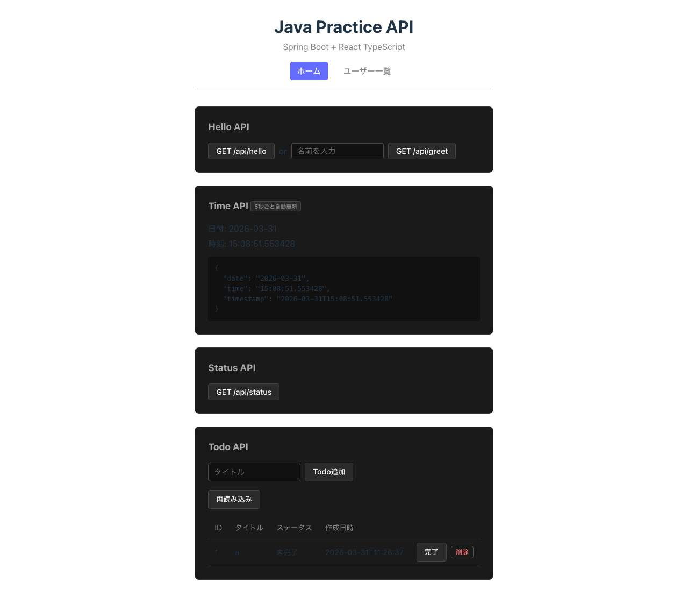
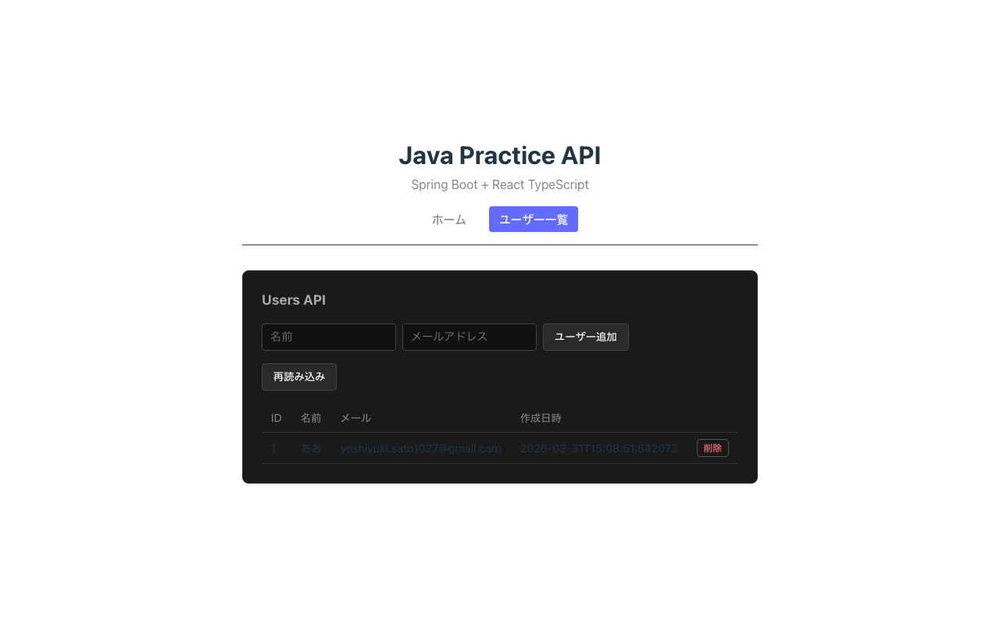

# Spring Boot + Doma REST API

Spring Boot と Doma ORM を使用した Todo/User 管理アプリケーションです。
フロントエンドは React + Vite で構成されています。

## 画面

### ホーム



Hello API・Time API・Status API・Todo API を1画面で操作できます。

### ユーザー一覧



ユーザーの追加・削除が行えます。

## 技術スタック

| レイヤー | 技術 |
|---|---|
| バックエンド | Java 21 / Spring Boot 3.5.0 |
| ORM (Todo) | Doma 3.6.0 |
| ORM (User) | Spring Data JPA / Hibernate |
| データベース | MySQL 8.0 (Docker) |
| フロントエンド | React 18 / TypeScript / Vite |
| ビルドツール | Gradle |
| CI | CircleCI |

## プロジェクト構成

```
java-practice/
├── backend/
│   └── src/main/
│       ├── java/com/example/javapractice/
│       │   ├── controller/
│       │   │   ├── ApiController.java      # /api/hello, /greet, /time, /health, /status
│       │   │   ├── TodoController.java     # /api/todos CRUD
│       │   │   └── UserController.java     # /api/users CRUD
│       │   ├── service/
│       │   │   ├── TodoService.java
│       │   │   └── UserService.java
│       │   ├── repository/
│       │   │   ├── TodoDao.java            # Doma DAO
│       │   │   └── UserRepository.java     # Spring Data JPA
│       │   └── entity/
│       │       ├── Todo.java               # Doma エンティティ
│       │       └── User.java               # JPA エンティティ
│       └── resources/
│           ├── application.properties
│           ├── schema.sql                  # todosテーブルDDL
│           └── META-INF/com/example/javapractice/repository/TodoDao/
│               ├── selectAll.sql
│               └── selectById.sql
├── frontend/                               # React + Vite
├── docker-compose.yml                      # MySQL
└── Makefile
```

## 起動方法

```bash
# ターミナル1: MySQL + バックエンド起動
make up && make backend

# ターミナル2: フロントエンド起動
make frontend

# ブラウザ
open http://localhost:5173
```

### その他のコマンド

```bash
make down      # MySQL停止
make test      # テスト実行
make format    # コードフォーマット (Spotless)
make install   # フロントエンド依存関係インストール
```

## APIエンドポイント

### Todo API (`/api/todos`)

| メソッド | パス | 説明 |
|---|---|---|
| GET | `/api/todos` | 一覧取得 |
| GET | `/api/todos/{id}` | 1件取得 |
| POST | `/api/todos` | 作成 |
| PUT | `/api/todos/{id}/toggle` | 完了/未完了を切り替え |
| DELETE | `/api/todos/{id}` | 削除 |

```bash
# 一覧取得
curl http://localhost:8080/api/todos

# 作成
curl -X POST http://localhost:8080/api/todos \
  -H "Content-Type: application/json" \
  -d '{"title": "買い物"}'

# 完了/未完了切り替え
curl -X PUT http://localhost:8080/api/todos/1/toggle

# 削除
curl -X DELETE http://localhost:8080/api/todos/1
```

### User API (`/api/users`)

| メソッド | パス | 説明 |
|---|---|---|
| GET | `/api/users` | 一覧取得 |
| GET | `/api/users/{id}` | 1件取得 |
| POST | `/api/users` | 作成 |
| DELETE | `/api/users/{id}` | 削除 |

```bash
# 一覧取得
curl http://localhost:8080/api/users

# 作成
curl -X POST http://localhost:8080/api/users \
  -H "Content-Type: application/json" \
  -d '{"name": "山田太郎", "email": "taro@example.com"}'

# 削除
curl -X DELETE http://localhost:8080/api/users/1
```

### ユーティリティ API (`/api`)

| メソッド | パス | 説明 |
|---|---|---|
| GET | `/api/hello` | Hello World |
| GET | `/api/greet?name=xxx` | 挨拶 |
| GET | `/api/time` | 現在時刻（date / time / timestamp） |
| GET | `/api/health` | ヘルスチェック（status / version / timestamp） |
| GET | `/api/status` | サーバーステータス（メモリ使用量） |

```bash
curl http://localhost:8080/api/health
# {"status":"UP","version":"0.0.1-SNAPSHOT","timestamp":"..."}
```

## CI

CircleCI で以下を自動実行します（push 時）。

1. Gradle 依存関係のキャッシュ復元
2. **Spotless** コードフォーマットチェック
3. **テスト実行**（H2 インメモリDBを使用）
4. テスト結果・成果物の保存
5. アプリケーションビルド

## 接続設定

`backend/src/main/resources/application.properties`

```properties
spring.datasource.url=jdbc:mysql://localhost:3306/practice_db
spring.datasource.username=root
spring.datasource.password=root
```

## 注意事項

- バックエンド起動前に `make up` でMySQLを起動してください
- Todo は Doma ORM（SQLファイルで管理）、User は Spring Data JPA を使用しています
- `todos` テーブルは `schema.sql` により `CREATE TABLE IF NOT EXISTS` で自動生成されます
